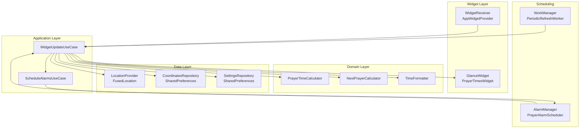

# Design Document

## Overview

The Islamic Prayer Times Widget is an Android application that provides a home screen App Widget displaying the five daily Islamic prayer times (Fajr, Dhuhr, Asr, Maghrib, Isha) computed from the device's current location. The widget highlights the next upcoming prayer, updates automatically throughout the day, and supports user configuration of the calculation method.

**Key design decisions:**

- **Jetpack Glance** is used for the widget UI layer, providing a Compose-style declarative API that compiles down to `RemoteViews`. This is the modern, recommended approach as of Android API 26+.
- **Adhan-Java** (`com.batoulapps.adhan:adhan:2.x`) is used as the prayer time calculation library. It is well-tested, supports all required calculation methods, and handles timezone/DST internally.
- **FusedLocationProviderClient** (Google Play Services) is used for location, providing coarse location with low battery impact.
- **AlarmManager** (exact alarms) is used for prayer-time-triggered updates, while **WorkManager** handles the periodic 60-minute background refresh. This hybrid approach satisfies both the strict timing requirement (prayer transitions within 2 minutes) and battery-friendly periodic updates.
- **SharedPreferences** (via `EncryptedSharedPreferences` wrapper) stores cached coordinates, last-update timestamp, and user settings.
- The app is written in **Kotlin** targeting Android API 26 (Android 8.0) minimum.

---

## Architecture

The application follows a layered clean architecture with clear separation between the widget presentation layer, domain logic, and data/platform layers.



**Data flow for a widget refresh:**

1. A trigger arrives (AlarmManager broadcast, WorkManager task, or user tap).
2. `WidgetUpdateUseCase` is invoked.
3. It reads cached coordinates from `CoordinatesRepository` and settings from `SettingsRepository`.
4. If coordinates are stale or absent, `LocationProvider` is queried.
5. `PrayerTimeCalculator` computes times using Adhan-Java.
6. `NextPrayerCalculator` determines the highlighted prayer.
7. `GlanceWidget` renders the updated `RemoteViews` via Glance.
8. `PrayerAlarmScheduler` sets the next exact alarm for the following prayer transition.

---

## Components and Interfaces

### PrayerTimesWidget (Glance Widget)

The root Glance composable. Reads `GlanceAppWidgetManager` size info to choose the correct layout variant (2×2, intermediate, 4×2/4×4).

```kotlin
class PrayerTimesWidget : GlanceAppWidget() {
    override suspend fun provideGlance(context: Context, id: GlanceId) { ... }
}
```

Layout variants:
- **Compact (2×2):** Single row — next prayer name + time.
- **Intermediate:** Next prayer + as many chronological prayers as fit.
- **Full (4×2 and 4×4):** All five prayers (+ optional Sunrise). Next prayer highlighted.

### WidgetReceiver

Extends `GlanceAppWidgetReceiver`. Handles `ACTION_APPWIDGET_UPDATE`, `ACTION_APPWIDGET_ENABLED`, and the custom `ACTION_PRAYER_ALARM` broadcast. Delegates to `WidgetUpdateUseCase`.

```kotlin
class WidgetReceiver : GlanceAppWidgetReceiver() {
    override val glanceAppWidget = PrayerTimesWidget()
    override fun onReceive(context: Context, intent: Intent) { ... }
}
```

### WidgetUpdateUseCase

Orchestrates a full widget refresh cycle. Returns a sealed `UpdateResult`.

```kotlin
sealed class UpdateResult {
    data class Success(val state: WidgetState) : UpdateResult()
    data class MissingLocation(val message: String) : UpdateResult()
    data class InvalidCoordinates(val message: String) : UpdateResult()
    data class StaleData(val state: WidgetState, val ageHours: Int) : UpdateResult()
}

class WidgetUpdateUseCase(
    private val locationProvider: LocationProvider,
    private val coordinatesRepository: CoordinatesRepository,
    private val settingsRepository: SettingsRepository,
    private val prayerTimeCalculator: PrayerTimeCalculator,
    private val nextPrayerCalculator: NextPrayerCalculator,
    private val alarmScheduler: PrayerAlarmScheduler,
)
```

### PrayerTimeCalculator

Wraps the Adhan-Java library. Accepts `Coordinates`, `DateComponents`, and `CalculationMethod`; returns `PrayerTimesResult`.

```kotlin
interface PrayerTimeCalculator {
    fun calculate(
        coordinates: Coordinates,
        date: DateComponents,
        method: CalculationMethod,
        showSunrise: Boolean,
    ): PrayerTimesResult
}

sealed class PrayerTimesResult {
    data class Success(val prayers: List<PrayerEntry>, val sunrise: PrayerEntry?) : PrayerTimesResult()
    data class InvalidCoordinates(val reason: String) : PrayerTimesResult()
}
```

Coordinate validation is performed before delegating to Adhan:
- Latitude must be in `[-90, 90]`
- Longitude must be in `[-180, 180]`

### NextPrayerCalculator

Pure function — given a list of `PrayerEntry` items and the current `Instant`, returns the index of the next prayer or `null` if all prayers have passed.

```kotlin
interface NextPrayerCalculator {
    fun findNext(prayers: List<PrayerEntry>, now: Instant): Int?
}
```

### TimeFormatter

Formats a `Date`/`Instant` to a display string respecting the device's 12/24-hour system setting.

```kotlin
interface TimeFormatter {
    fun format(time: Instant, context: Context): String
}
```

### LocationProvider

Wraps `FusedLocationProviderClient`. Suspending function with a 30-second timeout.

```kotlin
interface LocationProvider {
    suspend fun getLocation(timeoutMs: Long = 30_000): LocationResult
}

sealed class LocationResult {
    data class Success(val coordinates: Coordinates, val timestamp: Instant) : LocationResult()
    object PermissionDenied : LocationResult()
    object Timeout : LocationResult()
    object Unavailable : LocationResult()
}
```

### CoordinatesRepository

Persists the last known coordinates and their acquisition timestamp in `SharedPreferences`.

```kotlin
interface CoordinatesRepository {
    fun getCached(): CachedCoordinates?          // null if never obtained
    fun save(coordinates: Coordinates, timestamp: Instant)
    fun isFresh(maxAgeHours: Int = 24): Boolean
}

data class CachedCoordinates(
    val coordinates: Coordinates,
    val timestamp: Instant,
)
```

### SettingsRepository

Persists user preferences.

```kotlin
interface SettingsRepository {
    fun getCalculationMethod(): CalculationMethod
    fun setCalculationMethod(method: CalculationMethod)
    fun isShowSunrise(): Boolean
    fun setShowSunrise(show: Boolean)
}
```

Default: `CalculationMethod.MUSLIM_WORLD_LEAGUE`, `showSunrise = false`.

### PrayerAlarmScheduler

Schedules exact `AlarmManager` alarms for each prayer time + 2-minute grace window. Uses `setExactAndAllowWhileIdle` to fire even in Doze mode.

```kotlin
interface PrayerAlarmScheduler {
    fun scheduleNext(prayers: List<PrayerEntry>)
    fun cancelAll()
}
```

### PeriodicRefreshWorker

A `CoroutineWorker` registered with WorkManager as a periodic task (60-minute interval, or 120-minute in battery saver mode). Invokes `WidgetUpdateUseCase`.

```kotlin
class PeriodicRefreshWorker(
    context: Context,
    params: WorkerParameters,
) : CoroutineWorker(context, params)
```

Battery saver detection uses `PowerManager.isPowerSaveMode`. The worker re-enqueues itself with the appropriate interval on each execution.

### SettingsActivity

Standard Android `Activity` hosting a Compose UI. Reads from and writes to `SettingsRepository`. Sends `ACTION_APPWIDGET_UPDATE` broadcast on Save to trigger an immediate widget refresh.

---

## Data Models

### CalculationMethod (enum)

```kotlin
enum class CalculationMethod {
    MUSLIM_WORLD_LEAGUE,
    ISNA,
    EGYPTIAN,
    UMM_AL_QURA;

    fun toAdhanParameters(): CalculationParameters = when (this) {
        MUSLIM_WORLD_LEAGUE -> CalculationMethod.MUSLIM_WORLD_LEAGUE.get()
        ISNA               -> CalculationMethod.NORTH_AMERICA.get()
        EGYPTIAN           -> CalculationMethod.EGYPTIAN.get()
        UMM_AL_QURA        -> CalculationMethod.UMM_AL_QURA.get()
    }
}
```

### Prayer (enum)

```kotlin
enum class Prayer { FAJR, SUNRISE, DHUHR, ASR, MAGHRIB, ISHA }
```

### PrayerEntry

```kotlin
data class PrayerEntry(
    val prayer: Prayer,
    val time: Instant,       // UTC instant; formatted for display by TimeFormatter
    val isNext: Boolean,
)
```

### Coordinates

```kotlin
data class Coordinates(
    val latitude: Double,    // [-90, 90]
    val longitude: Double,   // [-180, 180]
)
```

### WidgetState

The complete state object passed to the Glance composable via `GlanceStateDefinition`.

```kotlin
data class WidgetState(
    val prayers: List<PrayerEntry>,
    val sunrise: PrayerEntry?,
    val lastUpdated: Instant,
    val isLocationCached: Boolean,
    val errorMessage: String?,          // null when no error
    val staleDataAgeHours: Int?,        // null when data is fresh
)
```

### SharedPreferences Keys

| Key | Type | Description |
|-----|------|-------------|
| `pref_lat` | Float | Cached latitude |
| `pref_lon` | Float | Cached longitude |
| `pref_location_ts` | Long | Epoch millis of last location fix |
| `pref_calc_method` | String | `CalculationMethod.name()` |
| `pref_show_sunrise` | Boolean | Sunrise toggle |
| `pref_last_compute_ts` | Long | Epoch millis of last successful computation |

---

## Correctness Properties

*A property is a characteristic or behavior that should hold true across all valid executions of a system — essentially, a formal statement about what the system should do. Properties serve as the bridge between human-readable specifications and machine-verifiable correctness guarantees.*

### Property 1: Prayer time completeness and chronological ordering

*For any* valid coordinates (latitude in `[-90, 90]`, longitude in `[-180, 180]`) and any supported `CalculationMethod`, `PrayerTimeCalculator.calculate()` SHALL return exactly five prayer entries (Fajr, Dhuhr, Asr, Maghrib, Isha) with non-null times, and those times SHALL be strictly increasing (Fajr < Dhuhr < Asr < Maghrib < Isha).

**Validates: Requirements 1.1, 1.2, 2.1, 2.2**

---

### Property 2: Coordinate validation rejects out-of-range inputs

*For any* coordinate where latitude is outside `[-90, 90]` or longitude is outside `[-180, 180]`, `PrayerTimeCalculator.calculate()` SHALL return `InvalidCoordinates` and SHALL NOT return a `Success` result.

**Validates: Requirements 6.4, 6.5**

---

### Property 3: Next prayer identification correctness

*For any* list of chronologically ordered prayer entries and any current time `now`, `NextPrayerCalculator.findNext()` SHALL return the index of the prayer whose time is the smallest value strictly greater than `now`, or `null` if no such prayer exists (i.e., `now` is after the last prayer).

**Validates: Requirements 1.4, 1.5**

---

### Property 4: Calculation method settings round-trip

*For any* `CalculationMethod` value, saving it to `SettingsRepository` and then reading it back SHALL return the same `CalculationMethod` value.

**Validates: Requirements 2.3, 5.1, 5.6**

---

### Property 5: Stale data age label accuracy

*For any* last-computation timestamp `T` and current time `now` where `now − T ≥ 24 hours`, the stale-data age reported in `WidgetState.staleDataAgeHours` SHALL equal `floor((now − T).toHours())`.

**Validates: Requirements 6.2**

---

### Property 6: Time format respects device system setting

*For any* `Instant` value, `TimeFormatter.format()` SHALL return a string containing "AM" or "PM" when the device is configured for 12-hour format, and SHALL return a string containing no "AM"/"PM" suffix when the device is configured for 24-hour format.

**Validates: Requirements 1.1**

---

### Property 7: Distinct calculation methods produce distinct prayer times

*For any* two distinct `CalculationMethod` values and any valid coordinates, the prayer times computed by `PrayerTimeCalculator.calculate()` with one method SHALL differ from those computed with the other method for at least one of the five prayers.

**Validates: Requirements 2.2, 2.3**

---

### Property 8: Location refresh threshold

*For any* pair of coordinate sets where the Haversine distance between them exceeds 10 kilometres, the `LocationProvider` SHALL signal that a widget refresh is required. *For any* pair where the distance is 10 kilometres or less, no refresh SHALL be triggered.

**Validates: Requirements 3.5**

---

### Property 9: Intermediate widget size shows prayers in chronological order

*For any* widget size between 2×2 and 4×2 cells (exclusive), the rendered prayer list SHALL always include the next prayer as the first entry, followed by subsequent prayers in strictly chronological order, with the total count of displayed prayers being at least 1 and at most 5.

**Validates: Requirements 7.3**

---

## Error Handling

| Scenario | Behaviour |
|----------|-----------|
| Location permission denied | Widget displays "Tap to grant location permission" with a deep-link `PendingIntent` to `SettingsActivity`. |
| Location timeout, cache available | Widget displays cached times with a "Location cached" badge. |
| Location timeout, no cache | Widget displays "Location unavailable — tap to configure". |
| Invalid coordinates from cache | Widget displays "Invalid location data" (highest priority error). |
| Computation older than 24 h | Widget displays times alongside "Last updated N hours ago" label. |
| Settings save refresh timeout (>5 s) | `SettingsActivity` shows an inline error banner and a labelled Retry button. |
| WorkManager task failure | WorkManager retries with exponential back-off (default policy). |
| AlarmManager exact alarm denied (API 31+) | Falls back to `setAndAllowWhileIdle` (inexact); logs a warning. |

All errors are surfaced through `WidgetState.errorMessage` so the Glance composable has a single rendering path.

---

## Testing Strategy

### Unit Tests (JUnit 5 + MockK)

Focus on specific examples, edge cases, and error conditions:

- `PrayerTimeCalculatorTest`: known coordinates (e.g., Mecca) produce expected prayer times for a fixed date with each calculation method.
- `NextPrayerCalculatorTest`: boundary conditions — `now` exactly at a prayer time, `now` after Isha, empty list.
- `TimeFormatterTest`: 12-hour and 24-hour output for a fixed `Instant`.
- `CoordinatesRepositoryTest`: save/load round-trip, freshness check at exactly 24 h boundary.
- `WidgetUpdateUseCaseTest`: each `UpdateResult` branch is exercised with mocked dependencies.

### Property-Based Tests (Kotest + Kotest Property Testing)

Each property test runs a minimum of **100 iterations** using Kotest's `forAll` / `checkAll` generators.

Tag format: `// Feature: islamic-prayer-times-widget, Property <N>: <property_text>`

| Test | Property | Generator |
|------|----------|-----------|
| `PrayerTimesCompletenessAndOrderTest` | Property 1 | `Arb.double(-90.0, 90.0)` × `Arb.double(-180.0, 180.0)` × `Arb.enum<CalculationMethod>()` |
| `CoordinateValidationTest` | Property 2 | `Arb.double` filtered to out-of-range lat or lon values |
| `NextPrayerCorrectnessTest` | Property 3 | `Arb.list(Arb.instant(), 1..5)` sorted ascending × `Arb.instant()` |
| `CalculationMethodRoundTripTest` | Property 4 | `Arb.enum<CalculationMethod>()` |
| `StaleDataAgeTest` | Property 5 | `Arb.instant()` pairs where difference ≥ 24 h |
| `TimeFormatTest` | Property 6 | `Arb.instant()` × `Arb.boolean()` (is24Hour) |
| `DistinctMethodsProduceDifferentTimesTest` | Property 7 | `Arb.pair(Arb.enum<CalculationMethod>(), Arb.enum<CalculationMethod>())` filtered to distinct pairs × valid coordinates |
| `LocationRefreshThresholdTest` | Property 8 | `Arb.pair(Arb.coordinates(), Arb.coordinates())` split by Haversine distance > 10 km vs ≤ 10 km |
| `IntermediateSizeLayoutTest` | Property 9 | `Arb.int(3..7)` × `Arb.int(2..3)` (intermediate cell dimensions) × `Arb.list(PrayerEntry, 5)` |

### Integration Tests

- `LocationProviderIntegrationTest`: verifies `FusedLocationProviderClient` wiring on a real device or emulator (single execution).
- `WorkManagerIntegrationTest`: verifies `PeriodicRefreshWorker` enqueues and executes without crashing (1–2 executions).
- `AlarmSchedulerIntegrationTest`: verifies `PrayerAlarmScheduler` registers alarms visible via `AlarmManager` (single execution).

### Widget UI Tests (Espresso + Glance test utilities)

- Verify compact layout renders only next prayer at 2×2 size.
- Verify full layout renders all five prayers at 4×2 size.
- Verify error message is displayed when `WidgetState.errorMessage` is non-null.
